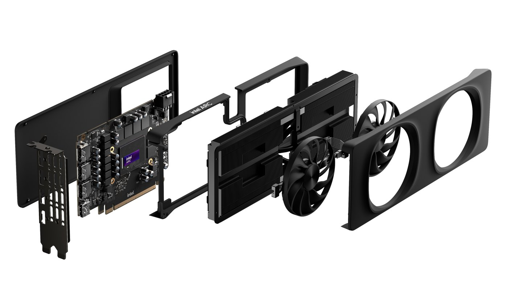
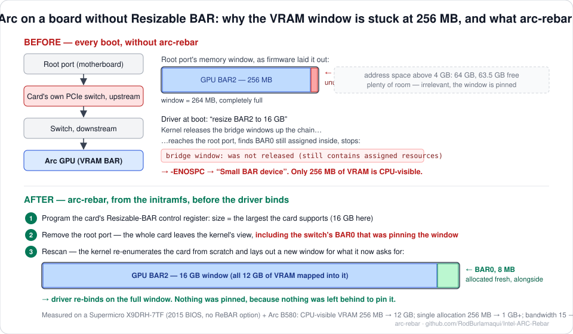

# arc-rebar — Resizable BAR for Intel Arc GPUs on firmware without ReBAR support

Copyright (c) 2026 Rod Burlamaqui. Free for personal use; **commercial licences for sale** — see [LICENSE](LICENSE) §9.

> **USE AT YOUR OWN RISK. NO WARRANTY.** Provided "as is". The author accepts no
> liability for data loss, hardware damage, downtime or any other loss arising
> from its use. It writes one PCI register and re-enumerates one PCIe root port
> at boot; it is designed to have no effect rather than a harmful one, but that
> cannot be guaranteed on hardware the author has never seen. Read
> [DISCLAIMER.md](DISCLAIMER.md) in full before running anything. Back up first.

**What it is.** A boot-time tool that makes an Intel Arc discrete GPU expose its
full VRAM on motherboards whose BIOS has no Resizable BAR option — **without
modifying firmware, the kernel, or Intel's drivers**. It runs from the initramfs
at every boot, before the GPU driver loads, and it includes the diagnostics that
tell you whether you have the problem and prove the fix worked.



<sub>Intel Arc B580 Limited Edition. Photo © Intel Corporation, from Intel's newsroom press kit for the Arc B-Series launch (Dec 2024), reproduced with credit. The photo is Intel's and is **not** covered by this project's licence.</sub>



**Tested on** a Supermicro X9DRH-7TF (Intel C602, two Xeon E5-2670 v2, AMI BIOS
3.2 from 2015 — no ReBAR option) with an Intel Arc B580 12 GB, Debian 13, kernel
7.1.8, `xe` driver. Persistent across reboots; the real boot log is below.

| | Before | After |
|---|---|---|
| CPU-visible VRAM (BAR2) | 256 MiB | 16 GiB window — all 12 GB of VRAM reachable |
| Vulkan device heap | 11.68 GiB device-only + a **256 MiB** host-visible scrap | **one 11.93 GiB** heap |
| Largest single OpenCL allocation | 256 MiB | 1 GiB (the runtime's own limit) |
| Measured VRAM bandwidth (saxpy) | 15 GB/s | 392 GB/s |
| 4K Vulkan filter (ffmpeg gblur) | stalls, 0 frames | 39–50 fps |
| Media encode/decode (VAAPI) | works | works (was never affected) |

---

## 1. Do you have this problem?

Your kernel log says so directly:

```
sudo dmesg | grep -E 'resize bar|Small BAR'
```
```
xe 0000:86:00.0: [drm] Attempting to resize bar from 256MiB -> 16384MiB
xe 0000:86:00.0: [drm] Failed to resize BAR2 to 16384MiB (-ENOSPC). Consider enabling 'Resizable BAR' support in your BIOS
xe 0000:86:00.0: [drm] Small BAR device
```

`Small BAR device` means only 256 MB of your VRAM is CPU-accessible. Any single
allocation over 256 MB fails; anything that streams data through that window
crawls. To see whether it is specifically the cause this tool fixes:

```
sudo dmesg | grep 'was not released'
```
```
pcieport 0000:80:03.0: bridge window [...]: was not released (still contains assigned resources)
```

That line is the signature. The tool's own check does all of this and more:

```
sudo arc-rebar diagnose          # from the .deb
sudo ./diagnose.sh               # from a source checkout
```

Its last line is one of: **`YES: pinned window, all safety checks pass`** (this tool
applies), `BAR already at full size` (you don't need it), or `NOT SAFE / NOT
APPLICABLE here: skip reason=...` (see §5).

## 2. What is actually wrong

It is not "your BIOS is too old" in the way that phrase suggests. Intel Arc cards
carry an **integrated PCIe switch** on the card. The switch's upstream port has
its own small BAR (8 MB), and firmware places it in the same prefetchable memory
window as the GPU's VRAM BAR:

```
root port          prefetchable window 264 MB   <-- pinned by the line below
 └ switch upstream   BAR0  8 MB                 <-- owned by pcieport, unused, never released
   └ switch downstream
     └ Arc GPU       BAR2  256 MB               <-- wants 16 GB
```

When the `xe` driver asks the kernel to enlarge BAR2, the kernel releases the
bridge *windows* up the chain — but never a bridge's *own BAR*. It reaches the
root port, finds the switch's BAR0 still assigned inside the window, refuses to
release it, and the 16 GB request has nowhere to go: `-ENOSPC`. Free address
space is irrelevant; the test machine had 63 GB free above 4 GB.

Intel's own engineers identified the same thing and posted a kernel quirk for it
("PCI: Release BAR0 of an integrated bridge to allow GPU BAR resize", 2025,
device IDs 0x4fa0 / 0x4fa1 / 0xe2ff). It stalled in review and is not in
mainline as of kernel 7.1. This tool does the equivalent from userspace.

Full investigation with every log line: [docs/ROOT-CAUSE.md](docs/ROOT-CAUSE.md).
Every test command with before/after numbers: [docs/TESTS.md](docs/TESTS.md).

## 3. What exactly it does

The boot script `scripts/init-premount/arc-rebar` runs once per boot from the
initramfs, after udev has enumerated PCI and before the root filesystem is
mounted. In order:

| Step | Action | Refuses / stops if |
|---|---|---|
| 0 | Read the kernel command line | `norebar` present → does nothing |
| 1 | **Find the GPU**: first PCI device with vendor `8086`, class VGA, and a Resizable BAR extended capability (or the one named by `rebar.dev=`) | none found → does nothing |
| 2 | **Find its root port**: the first hop below the host bridge in the GPU's sysfs path. Require the path to be exactly *root port → card switch upstream → card switch downstream → GPU* | deeper path (external switch, riser, Thunderbolt) → `skip unexpected-topology` |
| 3 | **Check the root port carries only this card**: every device beneath it must be Intel and be a bridge, the GPU, or the card's HDMI audio | anything else (an NVMe, a NIC…) → `skip shared-root-port` |
| 4 | **Read the card's ReBAR capability**: supported sizes bitmask and current size field. Target = the largest the card supports (or `rebar.size=`) | — |
| 5 | **Measure MMIO room** from `/proc/iomem`: the largest host-bridge window above 4 GB for this root bus. Step the target down until the BAR plus 64 MB fits (or 2× the BAR if the window start is unaligned) | no window above 4 GB → `skip no-mmio-window-above-4g`; nothing ≥ 512 MB fits → `skip mmio-window-too-small` |
| 6 | Compare current vs target | already at target → `none` (no-op; this is what a ReBAR-capable board looks like) |
| 7 | **Unbind** any driver already attached beneath the root port (`xe`, `snd_hda_intel`); `pcieport` is left alone | — |
| 8 | **Write the ReBAR control register** (`setpci … ECAP_REBAR+8.l`), setting only the size field to the target | write fails → `skip setpci-write-failed` |
| 9 | **Remove the root port** (`echo 1 > /sys/bus/pci/devices/<rootport>/remove`). This drops the whole card from the kernel's view — including the switch's BAR0 that was pinning the window | — |
| 10 | **Rescan** (`echo 1 > /sys/bus/pci/rescan`). The kernel re-enumerates the card from scratch. Because BAR2 now *advertises* the big size and nothing is pinned, it allocates BAR0 and the full-size BAR2 together into a fresh window. udev re-binds `xe`, which now sees the full aperture | — |
| 11 | **Verify** BAR2 got an address. If not, **roll back**: write the original size field, remove and rescan again, so the machine ends the boot on the old 256 MB rather than with no GPU | rollback also fails → `FAILED` (boot still continues; use `norebar`) |

Every exit path returns 0 — **boot is never failed**. The verdict is always in
the kernel log as `arc-rebar: PLAN: <verdict>`. `pci=realloc` on the kernel
command line is required so the rescan is allowed to size the bridge windows.

**What a fixed boot looks like** (real log from the test machine):

```
[    3.241] xe 0000:86:00.0: [drm] Attempting to resize bar from 256MiB -> 16384MiB
[    3.242] xe 0000:86:00.0: [drm] Failed to resize BAR2 to 16384MiB (-ENOSPC). Consider enabling 'Resizable BAR' support in your BIOS
[    3.244] xe 0000:86:00.0: [drm] Small BAR device                                   <-- xe's FIRST probe, before the fix
[    4.182] arc-rebar: gpu=0000:86:00.0 rootport=0000:80:03.0 cap=0x0007f000 ctl=0x00000822 size_field current=8 target=14
[    4.695] arc-rebar: unbound xe from 0000:86:00.0
[    5.753] arc-rebar: wrote ECAP_REBAR ctl=0x00000e22; removing 0000:80:03.0 and rescanning
[    7.861] xe 0000:86:00.0: [drm] VISIBLE VRAM: 0x0000381000000000, 0x0000000400000000   <-- re-probe on the 16G window
[   11.209] arc-rebar: PLAN: done gpu=0000:86:00.0 bar2=16384M
```

The `xe` driver loads from the initramfs *before* this script runs, so its first
attempt always fails and logs "Small BAR device" exactly as before — every boot.
That is expected. Judge by the later `VISIBLE VRAM` line, by `arc-rebar verify`,
and by `vulkaninfo`.

### What it changes on your system

Installing it touches exactly these things, all reversible:

| What | Where | Backup |
|---|---|---|
| The initramfs hook and the boot script | `/etc/initramfs-tools/hooks/arc-rebar`, `/etc/initramfs-tools/scripts/init-premount/arc-rebar` | — |
| Rebuilt initramfs | `/boot/initrd.img-<kernel>` | `/boot/initrd.img-<kernel>.arc-rebar.bak` |
| `pci=realloc` added to the kernel command line | `/etc/default/grub` | `/etc/default/grub.arc-rebar.bak` |
| A marker recording who installed the hook | `/var/lib/arc-rebar/hook-origin` | — |

Nothing else. No firmware, no BIOS settings, no driver files, no kernel modules.

### What it does not do

- It does not touch firmware or the BIOS. Nothing it writes survives a power cycle
  on the GPU side; the register is re-programmed at every boot.
- It does not make your VRAM bigger. A 12 GB card gets a 16 GB *window* because
  BAR sizes are powers of two and the card offers no 12 GB option; 12 GB is
  mapped into it and `vulkaninfo` shows ~11.9 GiB. The rest of the window points
  at nothing.
- It does not change the PCIe link speed. On the test board the card runs Gen3 x8
  because the *root port* is Gen3 — that is the platform's maximum.
- It does not fix the separate VAAPI `SIGBUS` crash the Intel media driver has on
  small-BAR cards. That is [arc-b580-vaapi-sigbus-fix](https://github.com/RodBurlamaqui/Intel-ARC-B580-vaapi-sigbus-fix) (§10).

## 4. Requirements

- Debian or Ubuntu (`initramfs-tools`). Kernel 6.12 or newer recommended (the
  `xe` driver's ReBAR support). `pciutils`.
- **Above 4G Decoding enabled in BIOS**, and an MMIO window above 4 GB at least
  as large as your VRAM rounded up to a power of two. `diagnose` checks this.
- The GPU directly in a slot on a root port of its own (no external PCIe switch,
  riser, or Thunderbolt in between). `diagnose` checks this.
- A second way into the machine (SSH) if you run the optional live test, which
  turns the local display off for about ten seconds.
- Other initramfs systems (dracut, mkinitcpio): the boot script is plain POSIX
  `sh` and needs only `setpci`; porting it is a Modification under the licence —
  ask first.

## 5. Where it applies — and where it refuses

`diagnose` runs the boot script's own checks in dry-run mode and reports what it
*would* do. The installer refuses unless that answer is "act".

| Situation | Verdict |
|---|---|
| Intel Arc (Battlemage or Alchemist) directly in a slot, small BAR, room above 4 GB | **acts** — the case it fixes |
| Firmware already supports ReBAR / BAR already at maximum | `none` — no-op |
| No Intel GPU with a ReBAR capability (AMD, NVIDIA, Intel iGPU) | `none` — no-op |
| GPU behind an external switch, riser, or Thunderbolt | `skip unexpected-topology` |
| Other devices share the GPU's root port | `skip shared-root-port` |
| No MMIO window above 4 GB (Above 4G Decoding off) | `skip no-mmio-window-above-4g` |
| Window above 4 GB too small for even 512 MB | `skip mmio-window-too-small` |
| Window fits a smaller BAR than the card's maximum | **acts with the smaller size**, logs the step-down |
| BAR2 unassigned after the rescan | **rolls back** to the original size; `rolled-back` |
| `norebar` on the kernel command line | `skip norebar` |

Hardware-tested: Battlemage on the board above, plus the MMIO-too-small,
no-window and step-down refusals against faked `/proc/iomem` files. The
shared-root-port, unexpected-topology and rolled-back paths are reviewed, not
hardware-tested. Alchemist is untested (same switch design; Intel's quirk
targets both).

## 6. Install

Full step-by-step with the exact output you should see at every step, and what
to do if you don't: **[INSTALL.md](INSTALL.md)**. The short form:

**Debian / Ubuntu, from the `.deb`** — download it from the [Releases](https://github.com/RodBurlamaqui/Intel-ARC-Rebar/releases) page, or:

```
wget https://github.com/RodBurlamaqui/Intel-ARC-Rebar/releases/latest/download/arc-rebar_1.0.3_all.deb
wget https://github.com/RodBurlamaqui/Intel-ARC-Rebar/releases/latest/download/SHA256SUMS
```
```
sha256sum -c --ignore-missing SHA256SUMS         # must print: arc-rebar_1.0.3_all.deb: OK
```
```
sudo apt install ./arc-rebar_1.0.3_all.deb    # step 0: installs the tool; ENABLES NOTHING
```
```
sudo arc-rebar diagnose                         # step 1: last line must be "YES: pinned window, all safety checks pass"
```
```
sudo arc-rebar install                          # step 2: pre-checks, plan, type ACCEPT, backup, install, post-checks
```
```
sudo reboot                                     # step 3
```
```
sudo arc-rebar verify                           # step 4, after the reboot: expect "RESULT: PASS"
```

**From source:**

```
git clone https://github.com/RodBurlamaqui/Intel-ARC-Rebar.git
cd Intel-ARC-Rebar
```
```
sudo ./diagnose.sh          # step 1: last line must be "YES: pinned window, all safety checks pass"
```
```
sudo ./install.sh           # step 2: pre-checks, plan, type ACCEPT, backup, install, post-checks
```
```
sudo reboot                 # step 3
```
```
sudo ./verify.sh            # step 4, after the reboot: expect "RESULT: PASS"
```

**Cautious path** (recommended on a board nobody has tried): prove it live
before enabling it at boot. `sudo arc-rebar prepare` adds `pci=realloc` only;
reboot; `sudo arc-rebar live-test` runs the fix once over SSH with nothing
persistent changed; then install as above. Two reboots total. INSTALL.md
Path B covers it.

The installer: runs the environment and hardware pre-checks → shows the plan →
prints the licence and disclaimer and requires you to type `ACCEPT` → backs up
the initramfs and GRUB config → installs → verifies every piece is inside the
rebuilt initramfs, restoring the backup if not.

## 7. After it is installed

Every boot: the hook runs, fixes the BAR, `xe` re-binds on the full window —
about 8 seconds on the test machine. Check any time with:

```
sudo arc-rebar verify
```
```
  [ok]   pci=realloc active
  [ok]   hook installed
  [ok]   boot verdict: done gpu=0000:86:00.0 bar2=16384M
  [ok]   0000:86:00.0 BAR2 = 16384 MiB (size field 14 = card maximum)
  [ok]   0000:86:00.0 driver: xe
  [ok]   0000:86:00.0 DevSta: no correctable/fatal/unsupported-request errors
  [ok]   xe last probe VISIBLE VRAM: 0x0000381000000000, 0x0000000400000000
  [ok]   no AER error reports
  [ok]   vulkan: memoryHeaps: count = 2 ... 11.93 GiB
RESULT: PASS
```

## 8. Diagnostics

`diag/` is the read-only half of this app: it tells you what is going on before
you change anything and proves the change afterwards. Full detail in
[diag/README.md](diag/README.md) and [diag/INSTALL.md](diag/INSTALL.md).

| Command | What it tells you |
|---|---|
| `sudo arc-rebar diag bar-pin-check` | BAR2 size vs card maximum, the root port window, **which bridge BAR0 pins it**, MMIO room, the kernel's signature line, a verdict |
| `sudo arc-rebar diag pcie-link-truth` | which PCIe link is physical. The GPU function itself reports a *virtual* 2.5 GT/s x1 port — a trap; the real link is the card's upstream port |
| `arc-rebar diag vulkan-heaps` | a separate 256 MiB device-local heap = small BAR; one merged heap = full aperture |
| `arc-rebar diag ocl-alloc-ceiling` | the real single-allocation ceiling, by allocating for real (`clinfo` reports the wrong number), then total usable VRAM in chunks and measured bandwidth |
| `sudo arc-rebar diag gpu-health` | PCIe error bits, AER reports, hangs/resets, temperatures, clocks, throttle reasons |

From a source checkout: `diag/bin/<tool>.sh`; build the allocator with `make -C diag`.
Run them before and after to capture your own before/after numbers.

## 9. Safety, escape hatch, knobs

- **Escape hatch:** at the GRUB menu press `e`, append `norebar` to the `linux`
  line, boot. The script then does nothing and you are on the old 256 MB BAR.
- **Never fails a boot.** Every failure path logs and continues.
- **No-op when not needed.** If firmware or a future kernel ever enlarges the BAR
  itself, the script sees "already at target" and exits.
- **Rollback.** If the new BAR cannot be placed, it restores the old size rather
  than leaving the GPU without an address.
- Kernel command-line knobs: `norebar`; `rebar.dev=0000:86:00.0` to choose a GPU;
  `rebar.size=N` to force a size field (2^(N+20) bytes: 14 = 16 GB, 13 = 8 GB, 12 = 4 GB).
- Known realistic failure modes and what to do — including the possibility of a
  hang at the rescan on chipsets that dislike root-port re-enumeration (power
  cycle; nothing persistent changed on a live test) — are in
  [DISCLAIMER.md](DISCLAIMER.md) and the troubleshooting section of [INSTALL.md](INSTALL.md).

## 10. Related project

**[Intel-ARC-B580-vaapi-sigbus-fix](https://github.com/RodBurlamaqui/Intel-ARC-B580-vaapi-sigbus-fix)**
— the other half of the story on the same hardware. Before the BAR could be
enlarged, Intel's media driver crashed outright (`SIGBUS` in `vaInitialize`) on
any small-BAR card; that project backports Intel's upstream fix into a Debian 13
`.deb`. It stops the crash; arc-rebar removes the cause. Keep both installed:
the patched driver is harmless on a full aperture and necessary if this fix is
ever disabled.

## 11. Uninstall

```
sudo apt purge arc-rebar        # .deb: removes the tool AND the boot hook — but only if the .deb installed the hook
sudo ./uninstall.sh             # source checkout
```

`apt remove` (without purge) removes the tool and deliberately leaves an enabled
boot hook in place. Both leave `pci=realloc` in GRUB; it is harmless. To revert
it:

```
sudo cp /etc/default/grub.arc-rebar.bak /etc/default/grub
```
```
sudo update-grub
```

## 12. Repository layout

```
scripts/init-premount/arc-rebar   the boot-time fix (POSIX sh, self-checking)
hooks/arc-rebar                   initramfs-tools hook: ships setpci into the initramfs
diagnose.sh  prepare.sh  live-test.sh  install.sh  verify.sh  uninstall.sh
bin/arc-rebar                     the `arc-rebar` command (installed by the .deb)
diag/                             diagnostics: bin/ (five tools), src/ocl_test.c, Makefile, README, INSTALL
debian/  build-deb.sh             .deb build inputs and the script that builds it
docs/img/intel-arc-b580-press.jpg  Intel's press photo of the card (© Intel Corporation, credited; not under this licence)
docs/img/arc-rebar-pin.svg        the mechanism diagram (original artwork)
docs/ROOT-CAUSE.md                the full investigation, with the kernel log evidence
docs/TESTS.md                     every test command used, with before/after numbers
INSTALL.md  DISCLAIMER.md  LICENSE  CHANGELOG.md
```

## 13. Contributing

Bug reports are welcome — open an issue with the output of `sudo arc-rebar
diagnose` and `journalctl -k -b | grep -E 'arc-rebar|was not released|Small BAR'`.
Modifications and ports require the copyright holder's prior written approval
(LICENSE §3.2): open an issue describing the change before writing it.

## 14. Licence

Copyright (c) 2026 Rod Burlamaqui. Licensed, not sold, under the arc-rebar
Software License Agreement in [LICENSE](LICENSE):

- **Personal Use** — free of charge for private, non-commercial use by an individual.
- **Commercial Use — licences are for sale.** Any use by or for a business,
  institution, hardware or software vendor, or in providing services to others,
  and any incorporation of this code into another product, driver, firmware,
  kernel or package, requires a purchased commercial licence (LICENSE §3.1, §9).
  Enquiries welcome, including from GPU and platform vendors — contact in LICENSE §9.4.
- **Modification** — no derivative works, ports or modified distributions without
  prior written approval. Bug reports and proposed changes are welcome.
- **Resale** — no sale, sublicensing or distribution for payment without approval.
  Free redistribution of complete, unmodified copies is permitted.
- **No warranty** — see LICENSE §5–6 and [DISCLAIMER.md](DISCLAIMER.md).

Not an open-source licence. The B580 product photo in `docs/img/` is © Intel
Corporation (Intel newsroom press kit) and is excluded from this licence. The
underlying technique — programming the ReBAR
control register and re-enumerating the root port — is not claimed; it was first
published by andersevenrud for a Supermicro H11SSL-i. This licence covers this
implementation only.

## 15. Credits

- andersevenrud — the setpci + remove/rescan method, in a gist for the H11SSL-i + B580.
- Ilpo Järvinen and Lucas De Marchi (Intel) — the kernel-side analysis and the
  stalled quirk that confirmed the mechanism.
- The kernel's own log line, `was not released (still contains assigned
  resources)`, which was the whole answer once someone read it.
